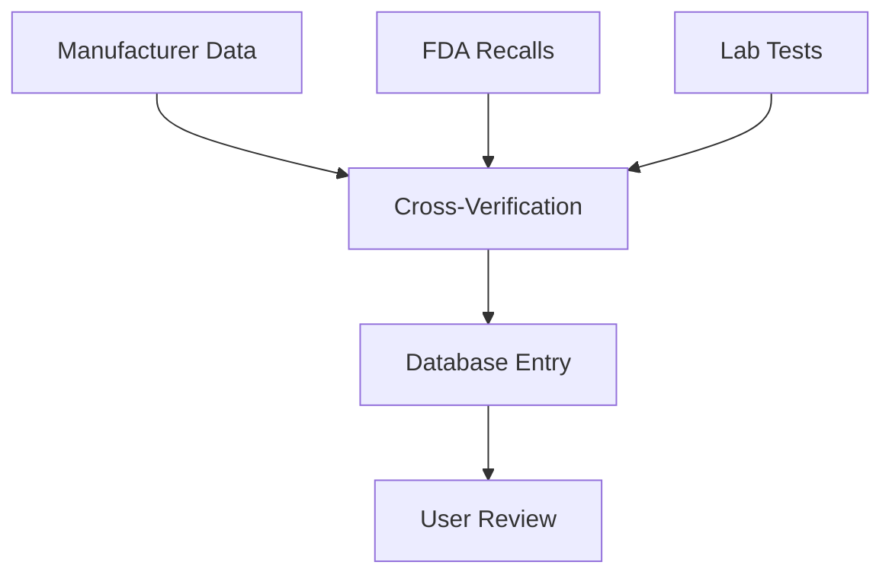

## Overview

Cat Food Central maintains a comprehensive database of 1362 dry cat foods from over 300 brands. This guide explains the sources behind the data, verification processes, key categories, user contributions, and tips for interpreting nutritional information. You can rely on this structured data to select the best food for your cat's needs.

<Callout kind="info">
  The database grows weekly through verified sources and community input, ensuring accuracy and relevance.
</Callout>

## Data Sources and Verification Process

We source data from official manufacturer websites, FDA recall notices, and independent lab analyses. Each entry undergoes a multi-step verification to maintain quality.

<Steps>
  <Step title="Collect Initial Data" icon="download">
    Gather product details from brand sites and packaging labels.
  </Step>
  <Step title="Cross-Verify" icon="search">
    Compare against multiple sources like Chewy.com and Petco listings.
  </Step>
  <Step title="Analyze Ingredients" icon="activity">
    Break down ingredients using AAFCO guidelines and veterinary reviews.
  </Step>
  <Step title="Flag Issues" icon="alert-triangle">
    Note recalls or controversies from FDA databases.
  </Step>
</Steps>



## Key Data Categories

The database organizes information into core categories for easy evaluation.

<Columns cols={3}>
  <Card title="Ingredients" icon="list">
    Full list with percentages, first five highlighted for quality assessment.
  </Card>
  <Card title="Recalls" icon="alert-circle">
    History of FDA recalls and safety alerts tied to specific products.
  </Card>
  <Card title="Reviews" icon="star">
    Aggregated user ratings and expert veterinary scores.
  </Card>
</Columns>

| Category     | Description                          | Example Data Points                  |
|--------------|--------------------------------------|--------------------------------------|
| Ingredients  | Breakdown by weight                  | Chicken (35%), Rice `{<20%}`         |
| Nutritional  | Guaranteed analysis                  | Protein `{>30%}`, Fat `{>12%}`       |
| Recalls      | Safety history                       | 2023 Salmonella recall               |
| Reviews      | Community and expert input           | 4.2/5 from 150 reviews               |

## User Contributions

Community input helps expand coverage. You can submit new products or updates via the dashboard.

<Tabs>
  <Tab title="Submit Product" icon="plus">
    Upload label photo and details.

    <CodeGroup tabs="JSON,Form">
    ```json
    {
      "brand": "Purina",
      "product": "Pro Plan Adult Shredded Blend",
      "ingredients": ["chicken", "rice", "corn gluten meal"]
    }
    ```
    ```html
    <form>
      <input name="brand" placeholder="Brand name">
      <input name="protein" type="number" placeholder="Protein %">
    </form>
    ```
    </CodeGroup>
  </Tab>
  <Tab title="Flag Error" icon="flag">
    Report discrepancies for quick review.
  </Tab>
</Tabs>

<Callout kind="tip">
  Contributions are moderated within 48 hours to ensure accuracy.
</Callout>

## Tips for Interpreting Labels and Scores

Follow these guidelines to evaluate entries effectively.

<ExpandableGroup>
  <Expandable title="Nutritional Scores" default-open="true">
    Scores range from 1-10 based on protein `{>30%}`, low carbs `{<20%}`, and meat-first ingredients. Higher scores indicate better nutrition for obligate carnivores.
  </Expandable>
  <Expandable title="Ingredient Analysis">
    Prioritize named meats over `{by-products}`. Watch for fillers like corn exceeding `{10%}`.
  </Expandable>
  <Expandable title="Recall History">
    Avoid foods with recent recalls. Check frequency and severity.
  </Expandable>
</ExpandableGroup>

<Columns cols={2}>
  <Card title="Next: Quickstart" icon="rocket" href="/quickstart">
    Start evaluating foods today.
  </Card>
  <Card title="API Access" icon="code" href="/authentication">
    Query the database programmatically.
  </Card>
</Columns>