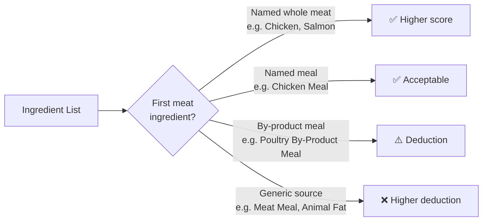

<Callout kind="info" collapsed="false">
  "By-product" doesn't automatically mean harmful. Organ meat, for example,
  is technically a by-product and is actually nutritionally dense. The problem
  is that the term covers a very wide range - from nutritious organs to
  low-quality rendered waste - with no way to tell which it is from the label.
</Callout>

## What counts as a by-product?

By-products in pet food typically include: organ meat, blood, bone, and other parts excluded from the human food supply. The nutritional value varies enormously depending on what's actually in the batch.

## Why does the score penalise them?

<ExpandableGroup>
  <Expandable title="Lack of transparency" default-open="false">
    "Chicken by-product meal" could mean anything from nutritious liver and
    kidney to low-value beaks, feet, and undeveloped eggs - all in the same
    batch, varying from run to run. There's no way to know from the label,
    and that inconsistency is the core issue.
  </Expandable>

  <Expandable title="Lower amino acid quality" default-open="false">
    By-products tend to have a less optimal amino acid profile than whole
    muscle meat. For cats - obligate carnivores who depend on specific amino
    acids like taurine and arginine - this matters more than it would for
    omnivores.
  </Expandable>

  <Expandable title="Signal of lower overall formulation quality" default-open="false">
    Foods that use named whole muscle meat (e.g. "deboned chicken",
    "salmon") as primary ingredients consistently show better overall
    formulation quality than those leading with by-products. The ingredient
    choice reflects the manufacturer's quality standards across the board.
  </Expandable>
</ExpandableGroup>

## What to look for instead

  

---

 

**Dive Deeper →**

- [Rule 4: Meat & Fat Sources](/rule-4-source-of-meat-and-fat-ingredients)

- [Rule 7: Meat Quality & Location](/rule-7-quality-and-location-impact-of-meat-ingredients)

- [Ingredient Order & Weight](/ingredient-order-and-relative-weight)

