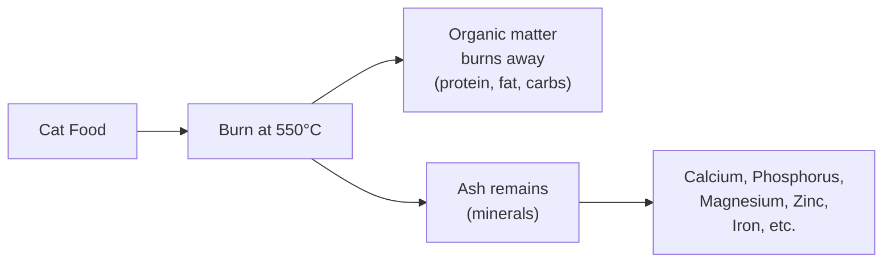

<Callout kind="info" collapsed="false">
  The term "crude ash" appears on guaranteed analysis panels alongside crude
  protein, crude fat, and crude fiber. The word "crude" just means it's
  measured as total mineral content without breaking down individual minerals.
</Callout>

## What ash actually is

When food is burned at very high temperature (around 550°C), all organic matter - protein, fat, carbohydrates - burns away. What's left is ash: the inorganic mineral content.

Ash isn't a single ingredient added to food - it's the collective measurement of all minerals present.

## Why ash content matters

<Tabs>
  <Tab title="Essential minerals" icon="zap">
    Minerals in ash are essential for cats - they need calcium and phosphorus
    for bone health, magnesium for metabolic function, and trace minerals
    like zinc, iron, and selenium for various biological processes.

    Too little ash means insufficient minerals. The food would be nutritionally
    incomplete.
  </Tab>

  <Tab title="Urinary health concerns" icon="droplet">
    Excessive ash - particularly high magnesium - has been linked to urinary
    crystal formation and bladder stones in cats. This was a major concern
    in the 1970s-80s and led to reformulations across the industry.

    Modern cat foods are formulated to keep magnesium levels appropriate,
    but ash content is still monitored as a general indicator.
  </Tab>

  <Tab title="What's a normal range?" icon="check-circle">
    **Typical ash content in dry cat food: 5-8%**

    - Below 5% - potentially insufficient minerals

    - 5-8% - normal, healthy range

    - Above 10% - may indicate excessive mineral content or low-quality
      ingredients with high bone meal content

    Most quality foods land between 6-8% ash.
  </Tab>
</Tabs>

## How ash is used in scoring

Cat Food Central doesn't directly penalize or reward ash content in the scoring algorithm. Ash is used primarily to **calculate carbohydrate percentage** when it's listed on the label:

**Carbohydrates % = 100 - Protein% - Fat% - Fiber% - Moisture% - Ash%**

When ash isn't stated on the label, it's estimated at **6%** for calculation purposes.

<Callout kind="tip" collapsed="false">
  You don't need to obsess over ash percentage. As long as the food is from
  a reputable manufacturer and ash falls in the 5-8% range, mineral content
  is likely appropriate. Focus on protein quality, carbohydrate levels, and
  ingredient sources instead.
</Callout>

 

---

 

**Dive Deeper →**

- [Food Composition & Nutrition](/guaranteed-analysis)

- [Dry matter basis calculation](/dry-matter-basis-calculation)

- [What are chelated minerals?](/faq/chelated-minerals)

