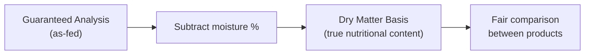

<Callout kind="info" collapsed="false">
  Without converting to dry matter basis, comparing two foods with different
  moisture levels is like comparing prices without accounting for package size.
  The numbers look different but don't tell you which is actually better value.
</Callout>

## Why moisture makes raw numbers misleading

A food listed as "30% protein" on the label could be nutritionally richer or poorer than another listed at "40% protein" - depending entirely on water content. Dry matter basis strips that water out so what remains is comparable.

## How the conversion works

The formula is simple:

**DMB % = (Nutrient % ÷ (100 - Moisture %)) × 100**

So a food with 30% protein and 10% moisture actually has **33.3% dry matter protein**.

## What this means for scoring

Every product on Cat Food Central is converted to dry matter basis before any scoring rule is applied. This means every score reflects the actual nutritional content of the food - not an inflated or deflated number caused by moisture differences.

<Callout kind="tip" collapsed="false">
  When comparing two foods, always use the dry matter numbers - not the
  as-fed numbers printed on the bag. The difference can be significant.
</Callout>

  

---

  

**Dive Deeper →**

- [Dry matter basis calculation - full methodology](/dry-matter-basis-calculation)

- [Food Composition & Nutrition](/guaranteed-analysis)

- [How scores work](/faq/how-scores-work)

