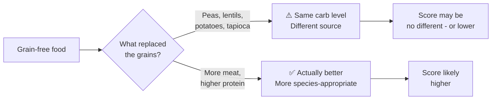

<Callout kind="alert" collapsed="false">
  "Grain-free" is a marketing term, not a nutritional standard. Many grain-free foods replace wheat and corn with peas, lentils, potatoes, and tapioca, which are equally high in carbohydrates.
</Callout>

## The grain-free myth

The logic behind grain-free sounds reasonable - cats don't eat grains in the wild, so removing them should make a food more species-appropriate. In practice, removing grains is only beneficial if what replaces them is *not* another carbohydrate source.

## What actually makes a food better

<ExpandableGroup>
  <Expandable title="Lower total carbohydrates - regardless of source" default-open="false">
    Whether carbs come from rice, corn, peas, or potatoes - they're all
    carbohydrates. A grain-free food with 40% dry matter carbohydrates from
    legumes is no better for a cat than a grain-inclusive food at the same level.
    The total carb percentage is what matters, not where it comes from.
  </Expandable>

  <Expandable title="Higher animal protein content" default-open="false">
    A food is more species-appropriate when it has more protein from named
    animal sources - not simply because it removed grains. Look at the
    dry matter protein percentage and what it comes from.
  </Expandable>

  <Expandable title="Named, quality meat sources at the top of the list" default-open="false">
    Grain-free or not, the ingredient quality signals are the same:
    named whole meats or meat meals in the first positions, no vague
    "meat" or "poultry" without a species name, minimal by-products.
  </Expandable>
</ExpandableGroup>

<Callout kind="tip" collapsed="false">
  Instead of filtering by "grain-free", use Cat Food Central to compare
  actual dry matter carbohydrate percentages and protein sources. That
  tells you far more than whether grains are present.
</Callout>

 

---

 

**Dive Deeper →**

- [Rule 1: Carbohydrates](/rule-1-amount-and-quality-of-carbohydrates)

- [Why carbohydrates are penalized](/faq/carbohydrates)

- [Why plant proteins are penalized](/faq/plant-proteins)

- [Ingredient Order & Weight](/ingredient-order-and-relative-weight)

