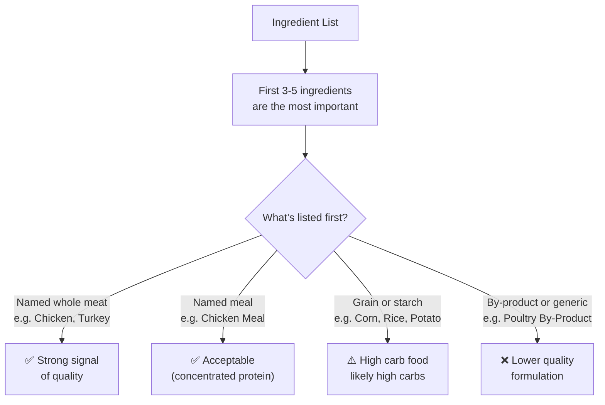

<Callout kind="info" collapsed="false">
  Ingredient order is regulated - manufacturers must list ingredients by
  pre-processing weight, from highest to lowest. What's listed first makes
  up the largest proportion of the food by weight.
</Callout>

## Reading the ingredient list correctly

## The moisture trick

Fresh meat (e.g. "chicken") is listed by its raw weight, which is mostly water - around 70-75% moisture. After cooking, it shrinks dramatically. "Chicken meal" by contrast is already dehydrated and concentrated, meaning it actually delivers more protein per gram in the final product.

<Tabs>
  <Tab title="Fresh meat first" icon="droplets">
    Seeing "chicken" as the first ingredient sounds great - and it can be.
    But after cooking, that chicken loses most of its weight. If the second
    and third ingredients are grains or starches, those may actually make up
    more of the final product than the chicken did.
  </Tab>

  <Tab title="Meal first" icon="package">
    "Chicken meal" as the first ingredient means the meat is already
    dehydrated and concentrated. It delivers more actual protein per gram
    in the finished food. Not as marketing-friendly, but often a better
    sign of protein density.
  </Tab>

  <Tab title="Ingredient splitting" icon="scissors">
    A common trick: splitting one ingredient into multiple forms to push
    it down the list. Example: "Chicken, Corn Flour, Corn Gluten, Corn
    Meal" - the three corn ingredients combined would outweigh the chicken,
    but listed separately they each appear smaller.
  </Tab>
</Tabs>

<Callout kind="tip" collapsed="false">
  The scoring system accounts for ingredient position under Rules 4 and 7.
  Named whole meats or meals in the top three positions score better than
  those buried further down the list.
</Callout>

 

---

 

**Dive Deeper →**

- [Ingredient Order & Weight - full guide](/ingredient-order-and-relative-weight)

- [Rule 4: Meat & Fat Sources](/rule-4-source-of-meat-and-fat-ingredients)

- [Rule 7: Meat Quality & Location](/rule-7-quality-and-location-impact-of-meat-ingredients)

