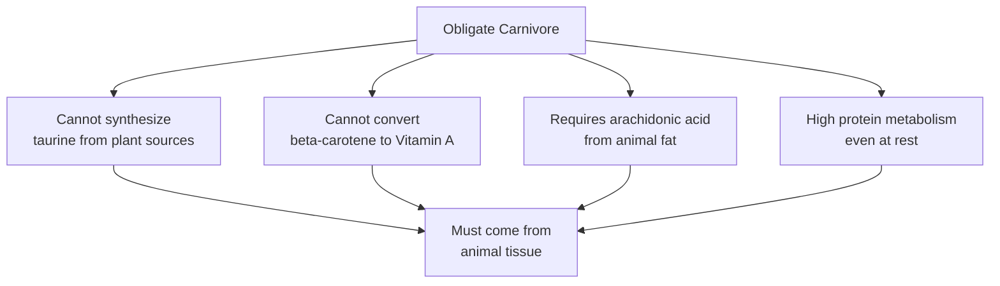

<Callout kind="alert" collapsed="false">
  A cat fed a low-protein or plant-heavy diet long-term is at real risk of
  nutritional deficiencies - particularly taurine deficiency, which can cause
  heart disease and blindness.
</Callout>

## What "obligate carnivore" actually means

Cats evolved as hunters. Their entire metabolism is built around processing animal protein - their livers run at a higher protein-processing rate than most mammals, even when fasting.

## Animal protein vs plant protein

<Tabs>
  <Tab title="🥩 Animal Protein" icon="check">
    - Complete amino acid profile including taurine and arginine

    - Highly bioavailable - cats digest and absorb it efficiently

    - Provides arachidonic acid (essential fatty acid cats can't make)

    - Contains preformed Vitamin A - ready for cats to use directly

    - Matches what cats evolved to eat
  </Tab>

  <Tab title="🌿 Plant Protein" icon="x">
    - Incomplete amino acid profile - lacks taurine entirely

    - Lower bioavailability for cats - harder to digest and utilise

    - No arachidonic acid

    - Contains beta-carotene only - cats cannot convert it to Vitamin A

    - Inflates total protein percentage on the label without the nutritional value
  </Tab>
</Tabs>

## The 50% benchmark

Cat Food Central's scoring baseline is set at **50% dry matter protein** - reflecting the protein content of a cat's natural prey diet. Foods above this score better; foods below score worse.

<Callout kind="tip" collapsed="false">
  A food can show "32% protein" on the bag and still be good - or "40% protein"
  and score poorly. What matters is what the protein comes *from*, and what the
  dry matter percentage is once moisture is stripped out.
</Callout>

  

---

  

**Dive Deeper →**

- [Rule 2: Protein Amount](/rule-2-amount-of-protein)

- [Rule 3: Non-Meat Protein](/rule-3-non-meat-protein-plant-or-vegetable)

- [Dry matter basis](/faq/dry-matter-basis)

