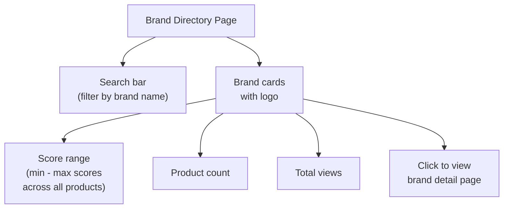

<Callout kind="info" collapsed="false">
  The brand directory shows every manufacturer in the database with their score
  range, product count, and total page views - giving you a quick snapshot of
  each brand's overall quality and popularity.
</Callout>

## Accessing the Brand Directory

Click **"Brands"** in the main navigation or go directly to [catfoodcentral.co/brands](https://catfoodcentral.co/brands)

## What You'll See

<Tabs>
  <Tab title="Brand Cards" icon="building">
    Each brand card displays:

    - Brand logo and name

    - Score range (shows the lowest and highest scoring products from that brand)

    - Total number of products in database

    - Total page views across all products

    The score range gives you an instant sense of the brand's quality
    consistency. A narrow range (e.g., 65-75) suggests consistent formulation.
    A wide range (e.g., 20-80) means some products are strong while others
    score poorly.
  </Tab>

  <Tab title="Search & Filter" icon="search">
    Use the search bar at the top to quickly jump to a specific brand by
    typing its name. Results filter instantly as you type.

    The directory is paginated - use the page numbers at the bottom to
    browse through all 340+ brands.
  </Tab>

  <Tab title="Sorting" icon="arrow-up-down">
    Currently brands are displayed alphabetically. Future updates may add
    sorting by average score, product count, or popularity.
  </Tab>
</Tabs>

## Viewing a Specific Brand Page

Click any brand card to open that brand's dedicated page, showing:

- **Brand overview** - logo, manufacturer, country of origin, brand history

- **Social links** - official website, Facebook, Instagram if available

- **All products** - every formula from that brand with individual scores

- **Product cards** - click any product to see its full details

<Callout kind="tip" collapsed="false">
  Use brand pages to quickly compare all formulas from a manufacturer you
  already trust, or to evaluate whether a brand's marketing claims match
  their actual product quality across the board.
</Callout>

## How to Use Brand Browse Effectively

<Steps>
  <Step title="Check score consistency" icon="bar-chart" title-type="p">
    Look at the score range on the brand card. Brands with narrow, high ranges
    (e.g., 70-82) are more reliable - their quality is consistent across
    formulas. Wide ranges suggest hit-or-miss quality.
  </Step>

  <Step title="Click through to the brand page" icon="mouse-pointer" title-type="p">
    View all products from that manufacturer side by side. This makes it easy
    to spot which formulas are strong and which to avoid - even within the
    same brand.
  </Step>

  <Step title="Compare across brands" icon="git-compare" title-type="p">
    Open multiple brand pages in separate tabs to compare how different
    manufacturers approach similar product categories (e.g., kitten formulas,
    indoor cat foods, grain-free lines).
  </Step>

  <Step title="Check product popularity" icon="trending-up" title-type="p">
    View counts on individual products show which formulas cat parents are
    researching most. High view counts don't guarantee quality, but they
    indicate which products are most searched.
  </Step>
</Steps>

## Reading Score Ranges

<Columns cols="2">
  <Card title="🟢 Consistent High Quality" horizontal="false">
    Score range: 70-85

    All or most products score well. This brand prioritizes quality
    ingredients consistently across their line.
  </Card>

  <Card title="🟡 Mixed Quality" horizontal="false">
    Score range: 45-75

    Some strong products, some weaker. Check individual scores carefully -
    don't assume all products from this brand are equal.
  </Card>

  <Card title="🔴 Low or Inconsistent" horizontal="false">
    Score range: 20-55

    Most products don't align well with feline nutritional needs. Even the
    top-scoring products may have significant compromises.
  </Card>
</Columns>

<Callout kind="alert" collapsed="false">
  Don't judge a brand solely by its score range - even excellent brands may
  have one or two lower-scoring specialty formulas (e.g., prescription diets).
  Always evaluate individual products, not just the brand as a whole.
</Callout>

 

---

  

**Related:**

- [Advanced Search](/using-the-site/advanced-search)

- [Compare products](/faq/compare-products)

- [How scores work](/faq/how-scores-work)

